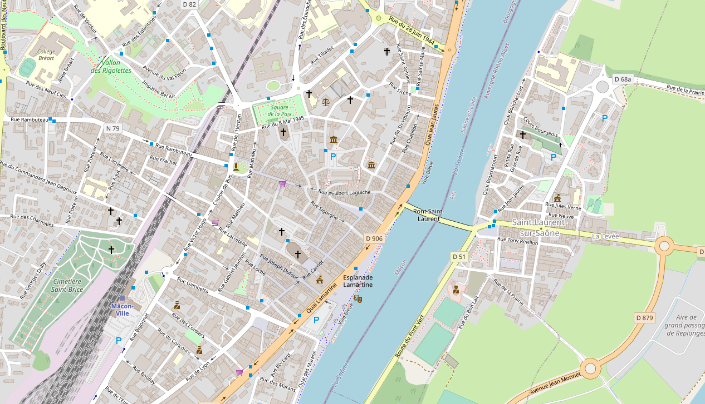

layout: true
  

`r paste0("
", params$event, " 

")` 

---

class: nec
layout: true

---

class: center, top

# .nec_title[Introduction]

--

## .nec_title[Mais qu'est-ce qu'on fait ici ?]

---

### .nec_title[Des données dans la médiation numérique, il y en a ...]

--

### .nec_title[... beaucoup !]

.center[

]

---

### .nec_title[Et des usages, aussi]

* des travailleurs sociaux qui orientent les bénéficiaires ;
* des élu·es qui conçoivent des politiques publiques ;
* des bénéficiaires qui cherchent des formations ou de l'accompagnement ;
* etc.

Autant d'usage .nec_title[territorialisés] des .nec_title[données] qui appellent naturellement des cartes.

--

Et ça, des cartes, il y en a.

---

class: center

### .nec_title[BAM !]

---

class: center

### .nec_title[BAM !]

---

class: center

### .nec_title[BAM !]

.footnote[Oui : les speaker's note sont aussi en open data.]

???

C'est cool mais cette différence pose un problème.

---

### .nec_title[Problématique]

.center[
.quote[### La .nec_title[discontinuité] dans les formats de données créé une .net_title[discontinuité] territoriale.
]
]

---

### .nec_title[Concrètement, ça veut dire quoi ?]

.center[

]

???

Quelqu'un qui règle mal ses freins à Macon.

---

### .nec_title[La solution : un standard]

.pull-left[
Définition :

.quote[un ensemble de recommandations développé et préconisé par un groupe représentatif d'utilisateurs]
]

.pull-right[

]

---

class: center

## .nec_title[Méthodologie]

---

### .nec_title[Comparer les formats existants]

.center[

]
.footenote[Source : [Marie Bernard](https://twitter.com/marie_BER/status/1450814606222499846)]

---

### .nec_title[Identifier les besoins au travers de familles d'usagers]

.center[

]

---

class: center

### .nec_title[Réfléchir aux facteurs d'échec et de réussite avec un atelier prospectif]

.pull-left[

]

.pull-right[

]
Source : [Marie Bernard](https://twitter.com/marie_BER/status/1451109790613229568)

---

class: center

## .nec_title[Enseignements]

---

### .nec_title[Rappel : l'objectif de départ]

.quote[nous sommes là pour créer un commun]

--

.quote[*(ce qu'on a commencé à faire ici)*]

---

### .nec_title[Les enseignements]

1. .nec_title[on part de rien] (*il existe un schéma des lieux d'inclusion numérique, c'est une bonne base, il faut pas réinventer la roue*)

--

2. .nec_title[penser léger] (*le standard ne doit pas compter trop de champs et pouvoir être enrichi par chaque territoire*)

--

3. .nec_title[toujours garder en tête les besoins finaux] (*ex. : "moi, j'imprime les documents"*)

--

4. .nec_title[la standardisation, c'est pas un sujet de geek] (*des participant·es ont envisagé de quitter l'atelier ... mais sont resté·es !*)

--

5. .nec_title[ça prend du temps]

--

6. .nec_title[ça coûte de l'argent] (*s'il y a des financeurs ou financeuses dans la salle ...*)

--

7. .nec_title[il faut s'y mettre dès maintenant] (*sortir un proto, présenter aux usager·ères, etc.*)

---

### .nec_title[ça tombe bien, on a un calendrier !]

.pull-left[Dans le cadre de l'atelier 3, nous avons élaboré des plannings proposant :

* des réunions ;
* des moyens ;
* des actions ...

Et il est (bientôt) disponible [en ligne](https://github.com/datactivist/nec2021_explo). Comme tout le matériel utilisé et produit pour ces ateliers.
]

.pull-right[

]

.footnote[Comme [toutes nos productions](github.com/datactivist/).]

---

class: inverse, center, middle

# .nec_title[Merci !]

.nec_title[Contact : [guillaume@datactivist.coop](mailto:guillaume@datactivist.coop) & [sylvain@datactivist.coop](mailto:sylvain@datactivist.coop)]]